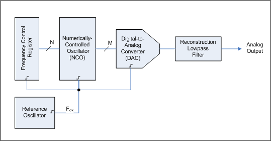

# DDS(Direct Digital Synthesis) 直接数字频率合成
## 基本原理 
#### 用一个稳定时钟来驱动存储正弦波(或其他波形)一个或多个证书周期的可编程只读存储器(PROM),随着地址计数器逐步执行每个存储器位置，每个位置对应的信号数字幅度会驱动DAC，进而产生模拟输出信号。

### Couterpart 锁相环 phase-locked loop
##### 一种反馈控制电路，用外部输入的参考信号控制环路内部震荡信号的频率和相位，在工作过程中，当输出信号频率与输入信号频率相等时，输出电压与输入电压保持固定相位差值，即输出电压与输入电压的相位被锁住
#### 锁相环的构成
##### 1.鉴相器 Phase Detector : 通过比较输入信号与压控振荡器的输出信号的相位，输出一定的电压信号。
##### 2.环路滤波器 Loop Filter : 滤除鉴相器输出电压中的高频分量和噪声，只保留低频分量
##### 3.压控振荡器 VCO : 受环路滤波器输出电压的控制，压控振荡器的振荡频率想输出信号的频率靠拢，直到频率相同，同时使VCO的输出信号与输入信号的相位保持特定的关系
##### 具体工作原理：当压控振荡器的频率由于某种原因而发生变化时，必然的产生相位变化，该相位变化在鉴相器中与参考晶体振荡器的稳定相位相比较，使相位器输出一个与相位误差成比例的误差电压，经低通滤波器，取出其中缓慢变化的直流电压分量，该分量用来控制压控振荡器中的压控元件数值(通常是变容二极管的电容值)，而该压控元件又是VCO振荡回路的组成部分，结果使VCO的输出频率又回到稳定值上，使得VCO的输出频率即有参考晶体振荡器决定。

## DDS 优点
### 调频速率快：DDS工作在数字域，只要更新控制字，输出频率就相应改变
### 频率分辩率高：DDS的频率控制字的宽度宽

## 基本构成
### 相位累加器：通过外部时钟源来对累加器进行计数，来推进正弦信号的频率，累加器的长度由DDS的频率控制字的位数控制
### 相位幅度转换：将相位累加器的相位转换成对应相位的幅度值，送入DAC中
### DAC：将输入的代表幅度的二进制数字信号转换成对应的模拟信号输出

## 应用
### DDS芯片选型
#### AD9833 频率相位均可数字编程 输出频率高达12.5MHz 频率寄存器为28位，可选正弦波，三角波，方波输出，SPI通信
#### AD9834 基本上同
#### AD9850 最高50MHz 正弦波和方波
#### AD9854 最高120MHz 正弦波和方波
#### AD9959 最高200MHz 正弦波

## 其他使用注意事项
##### DDS芯片好像都是差分电流输出，后续应接运放模块

## Reference
[CSDN 21电赛预测DDS AD9833](https://blog.csdn.net/qq_39400113/article/details/119220659)
[CSDN电赛数字信号发生方案](https://blog.csdn.net/Jefferymeng/article/details/125652631)
[CSDN DDS芯片AD9833+STM32(HAL)](https://blog.csdn.net/little_grapes/article/details/128425001?utm_medium=distribute.pc_relevant.none-task-blog-2~default~baidujs_baidulandingword~default-0-128425001-blog-125652631.235^v43^pc_blog_bottom_relevance_base7&spm=1001.2101.3001.4242.1&utm_relevant_index=3)

[(与信号无关)CSDN嵌入式精品专栏1](https://blog.csdn.net/little_grapes/category_11324240.html)

[CSDN锁相环基本原理](https://blog.csdn.net/Delete10/article/details/119677017)
#### 高频电子线路 张肃文
[Markdown语法教程](https://markdown.com.cn/basic-syntax/links.html)
[Everything you need to know about DDS](https://www.allaboutcircuits.com/technical-articles/direct-digital-synthesis/)
[DDS wiki](https://en.wikipedia.org/wiki/Direct_digital_synthesis)

## 待补充部分
### 后续运放接法
### 相关芯片对比及具体使用
### FPGA+DAC方案
### 更多相关信息