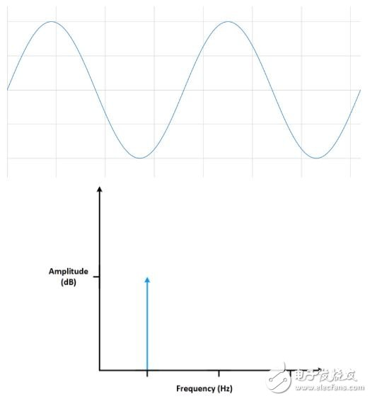
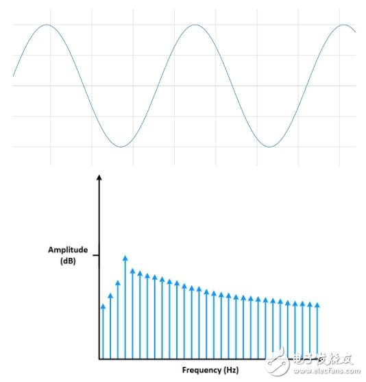

# 窗函数

## Preview
周知，信号可被转化成各种频率信号的加权和，用FFT提供了对信号的新视角
## Background

FFT分析信号的频率成分时，所用的是信号的有限数据集合，一个波形是由若干段小波组成的，如果测量的是周期信号，采集时间内有整数个周期，那么频谱就会比较直观

但在很多情况下，并不能测量到多个周期，这时测量的信号就会在频谱上与时间上的原信号显示出不同的特征，有限数据采样会使测量信号产生剧烈的变化。信号中无法组成整数周期的部分在FFT中会显示为高频分量，这些高频分量不存在于原信号中，且频率也可能远高于奈奎斯特采样频率，与频率产生混叠，类似于某个频率的能量泄露至其他频率，这种现象叫做频谱泄露。
## Solution
尽量使频谱的能量主要集中在主瓣，尽量使旁瓣的能量低
通过加窗尽可能减少在非整数周期上进行FFT产生的误差，加窗可以减少不连续部分的幅值。加窗包括将时间记录乘以有限长度，床的幅值逐渐变小，在边沿处为0.
好的窗函数在主瓣的能量相对集中，在旁瓣的能量要低
## Type
#### 1. 矩形窗 Rectangular Window
在窗口长度内常数值为1，之外为0
主瓣最宽，旁瓣衰减最慢，泄露效应最大，频率分辨率最高
#### 2. 汉宁窗 Hanning Window
由余弦函数构成，边缘向0平滑过渡，减少边界处的不连续性
主瓣宽于矩形框，旁瓣衰减速度更快，泄露效应较小
#### 3. 汉明窗 Hamming Window
与汉宁窗类似，在构造中使用而不同的系数
旁瓣相比汉宁窗更低，但主瓣更宽

>Refer to [link1](https://blog.csdn.net/u012308586/article/details/118766767) [link2](https://zhuanlan.zhihu.com/p/685232751) [link3]()

### shortage
窗函数的具体实现形式