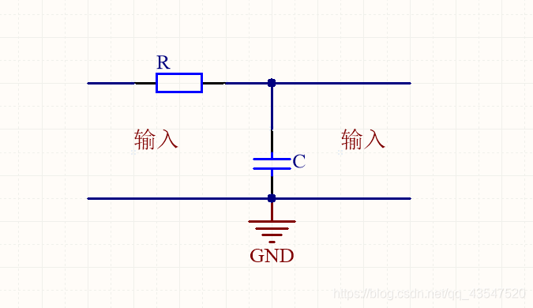
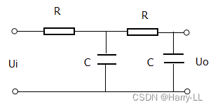
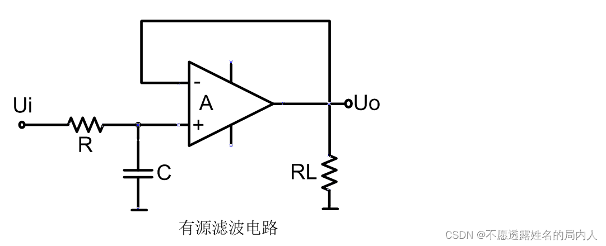
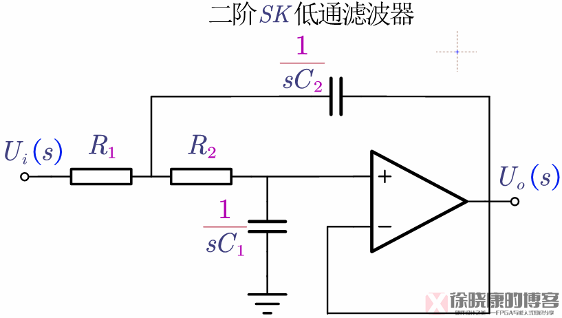
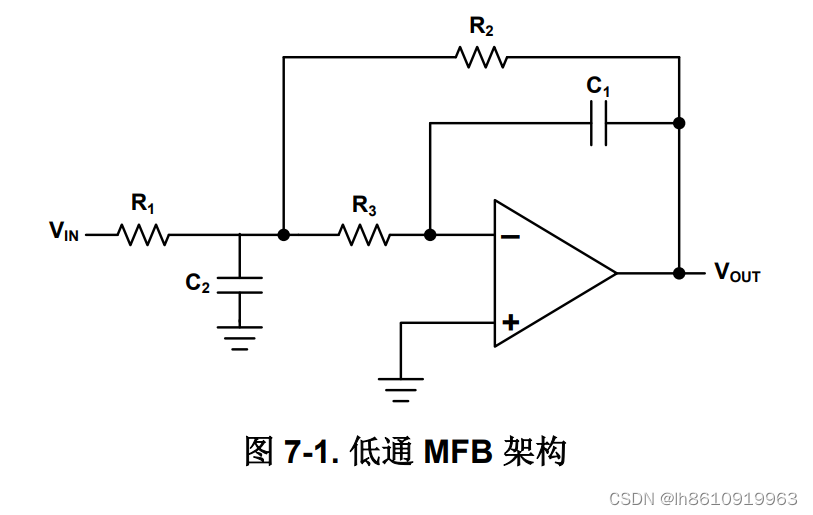

# RC低通滤波电路
## 1. 一阶

截止频率${f=\frac{1}{2{\pi}RC}}$
## 2.二阶

截止频率${f=\frac{1}{2{\pi}\sqrt{R_1R_2C_1C_2}}}$

品质因数${Q=\frac{\sqrt{R_1R_2C_1C_2}}{R_1C_1+R_2C_2}}$
Q值越高，滤波电路的选择性越好，但可能引起的相位失真越多

## 3.有源一阶

截止频率与无源一阶相同，仅在输出输入阻抗上有差别，可隔绝负载对滤波电路的影响
有源滤波器由RC网络与集成运放组成，频率响应受集成运放的性能参数有关，仅适合小信号处理

## 4.有源Sallen Key滤波器

截止频率${f=\frac{1}{2{\pi}\sqrt{R_1R_2C_1C_2}}}$
品质因数${Q=\frac{\sqrt{R_1R_2C_1C_2}}{R_1C_1+R_2C_2}}$
传递函数${H(jw)=A_m\frac{1}{1+\frac{1}{Qw_0}jw+\frac{1}{w_0^2}(jw)^2}}$
根据Q值的不同，可分为不同类型的滤波器
- Q<${\frac{1}{\sqrt{2}}}$:贝塞尔型，过渡带较为缓慢，相频特性比较优秀，群时延最低，可以有效降低信号时延
- Q=${\frac{1}{\sqrt{2}}}$:巴特沃兹型，特征频率等于截止频率，通带平缓没有起伏，电阻电容比例唯一，设计方便，应用广泛
- Q》${\frac{1}{\sqrt{2}}}$:切比雪夫型，在通带内有隆起，过渡带最陡峭

>Refer to [link1](https://blog.csdn.net/weixin_42837669/article/details/127327814#:~:text=%E6%BB%A4%E6%B3%A2%E5%99%A8%E5%9F%BA%E7%A1%80%E7%B3%BB%E5%88%97%E5%8D%9A%E5%AE%A2%EF%BC%8C%E4%BC%A0%E9%80%81%E9%97%A8%EF%BC%9A%E6%BB%A4%E6%B3%A2%E5%99%A8%E5%9F%BA%E7%A1%8001%E2%80%94%E2%80%94%E6%BB%A4%E6%B3%A2%E5%99%A8%E7%9A%84%E7%A7%8D%E7%B1%BB%E4%B8%8E%E7%89%B9%E6%80%A7%E6%BB%A4%E6%B3%A2%E5%99%A8%E5%9F%BA%E7%A1%8002%E2%80%94%E2%80%94%E6%BB%A4%E6%B3%A2%E5%99%A8%E7%9A%84%E4%BC%A0%E9%80%92%E5%87%BD%E6%95%B0%E4%B8%8E%E6%80%A7%E8%83%BD%E5%8F%82%E6%95%B0) [link2](https://blog.csdn.net/qq_39397153/article/details/129195771)

## 5.有源MFB滤波器

### 待仿真验证和实物实验