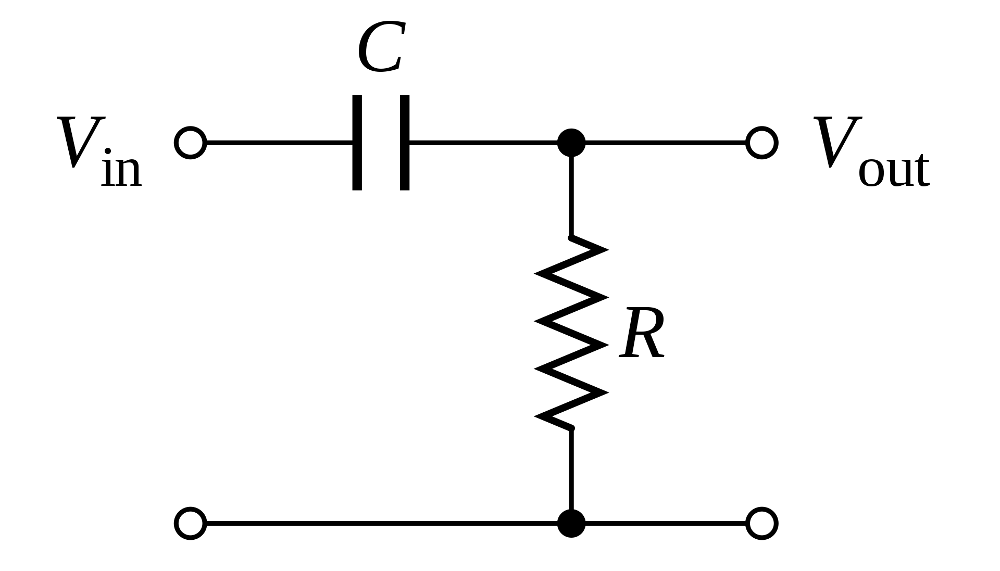
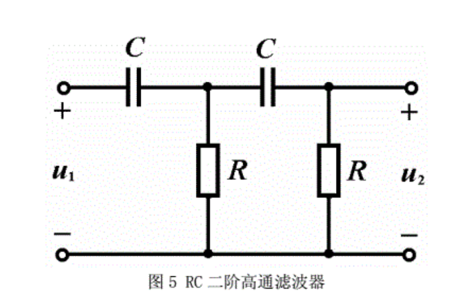
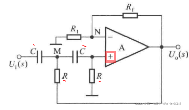
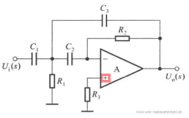

# RC高通滤波电路
## 1. RC一阶

截止频率${f=\frac{1}{2{\pi}RC}}$
## 2. RC级联一阶

截止频率${f=\frac{1}{2{\pi}RC}}$
## 3. 有源RC二阶 Sallen Key

截止频率${f=\frac{1}{2{\pi}\sqrt{R_1R_2C_1C_2}}}$
## 4.有源RC二阶 MFB

>Refer to [link1](https://blog.csdn.net/qq_41873236/article/details/123097110)