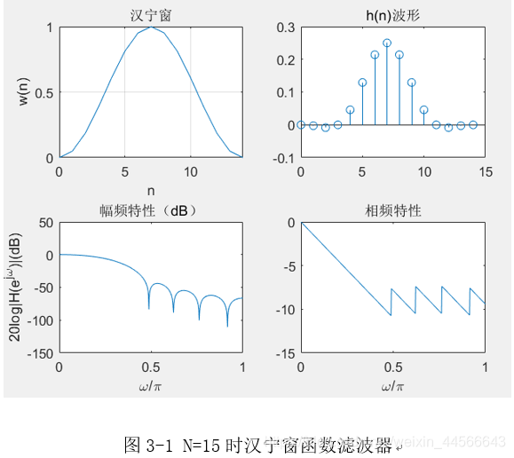

# 窗函数设计FIR数字滤波器
## 实验原理
无限长冲激响应数字滤波器的有点事利用模拟滤波器的设计结果，模拟滤波器的设计可以查阅大量图表，但缺点使相位非线性。如果需要实现相位线性，则要采用全通网络进行相位校正，即IIR滤波器很难设计成具有线性相位。FIR滤波器在保证幅度特性的同时，很容易实现严格的线性相位特性。
设计FIR数字滤波器的常用方法使窗函数发，这种方法一般先给定所要求的理想滤波器的频率响应$H_d(jw)$,要求设计一个FIR滤波器频率响应$H_f(jw)$,去逼近理想的频率响应。但窗函数法设计FIR数字滤波器是在时域进行的，因此，必须首先由理想频率响应$H_d(jw)$的傅里叶反变换推导出单位冲激响应$h(n)$
$h_d(n)=\frac{1}{2\pi}\int_{-\pi}^{\pi}H_d(jw)e^{jwn}dw$

## 具体窗函数
### 矩形窗

### 三角窗

### 汉明窗
### 汉宁窗

## Reference
> ADI公司有非常完整的文档体系 [ADI公司中文数据手册目录](https://www.analog.com/cn/lp/002/datasheet-portal.html)(可用于查找IC) [ADI公司技术指南目录](https://www.analog.com/cn/lp/002/technical-guide.html) 在ADI公司主页的搜索页面搜索*即可获得所有文档(如果想获得文档目录，建议爬虫爬一下) 此外在TI公司主页搜索***也有类似效果 在NI公司主页搜索* NXP公司主页搜索* ST公司主页搜索*