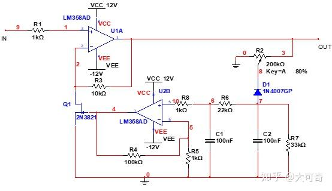
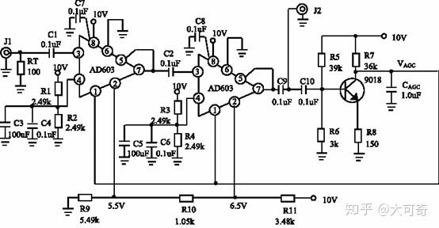

# AGC（自动增益控制）详细文档

## 一、概述
### 1.1 定义
AGC（Automatic Gain Control），即自动增益控制，是一种用于电子设备的技术，能够根据输入信号的强度自动调整放大器的增益，从而确保输出信号的幅度保持在稳定范围内。AGC 广泛应用于音频处理、通信系统、雷达系统等领域，解决了输入信号动态范围过大的问题。

### 1.2 背景
接收机的输出信号取决于输入信号和接收机的增益，由于各种原因，由于各种原因，接收机的输入信号变化范围很大，信号弱时可以是一微伏或几十微伏，信号强时可达几百毫伏，最强信号和最差信号可差几十分贝，这个变化范围称为接收机的动态范围。
为了防止强信号引起的过载，需要增大接收机的动态范围，这就要有增益控制电路。能够使放大电路的增益自动地随信号强度而调整的控制电路，简称自动增益控制AGC (Automatic Gain Control)电路，它能够在输入信号幅度变化很大的情况下，使输出信号幅度保持恒定或仅在较小范围内变化，不至于因为输入信号太小而无法正常工作，也不至于因为输入信号太大而使接收机发生饱和或堵塞。

## 二、工作原理

### 2.1 基本概念
自动增益控制电路的作用是：当输入信号电压变化很大时，保持接收机输出电压恒定或基本不变。简单来说就是当输入信号很弱时，接收机的增益较大；当输入信号很强时，自动增益控制电路进行控制，使接收机的增益变小。这样，当接收信号强度变化时，接收机的输出端的信号基本不变或保持恒定。
1. **信号检测器**：用于监测输入信号的幅度。
2. **控制器**：根据检测结果计算所需的增益调整量。
3. **可变增益放大器（VGA）**：根据控制器的指令调整信号的放大倍数。

## 2.2 分类
- **反馈式**：检测电路输出信号幅度大小，调整增益大小：稳定，动态范围不太高，可以处理的信号增益范围有限，对线性度要求不高，最大带宽受限
- **前馈式**：检测电路输入信号幅度大小，调整增益大小：可以处理比较大的信号变化，稳定时间只取决于信号检测支路，对线性度要求更高
## 模拟电路实现

原理图中，输入信号经电阻 R1送往运放F1的同相输入端，二极管VD对运放A1的输出信号整流后，经过一个π形滤波电路得到一个负向的 AGC 电压，这一电压经运放A2 放大后送往场效应管2N3821的栅极。 1）当输入信号的幅值较大时，相应地得到了较大的 AGC 电压，运放A2输出较大的负压至场效应管2N3821的栅极，增大了场效应管 2N3821 的源漏极间的电阻，从而减小了运放A1的放大倍数。输入信号的幅度进一步加大时，场效应管 2N3821 的源漏极间的电阻也会进一步加大，使运放A1的放大倍数进一步减小；直至场效应管 2N3821 的源漏极被完全夹断，这时运放A1失去放大能力成了电压跟随器。2）反之，当输入信号的幅值较小时，AGC 电压也很小，运放A2输出AGC电压也较小，场效应管2N3821的源漏极问的电阻很低，使运放Al得到较大的放大倍数，从而在A1 的输出端可以得到幅值较大的信号。
该方案优点是电路比较简单，易于实现；缺点是能够实现AGC功能的输入信号电压幅值范围比较窄，增益动态范围较小，高频响应差，场效应管工作在非线性的可变电阻区，线性差。该方案适合作为学生模电实验课的实验电路。

原理分析：经两级AD603放大后的信号，一路由J2输出，另一路则由C10输入到三极管2SC1815用于AGC检波。三极管的发射极PN结完成AGC检波，并由集电极经电容CAGC滤波后送出AGC控制电压VAGC。
1）输入信号增大时，三极管的基极瞬时电流也增大，相应的集电极电流也跟着增大，从而R7两端的瞬时压降也增大，则集电极瞬时电压减小，经滤波后得到的VAGC也相应减小。反馈到输入端1，2，经过自动增益调解减小增益，使输出稳定； 2）反之，输入信号减小时，VAGC则会增大，即VAGC与输入信号的强度成反比，符合AGC电压反向控制要求。

## 数字模拟电路实现