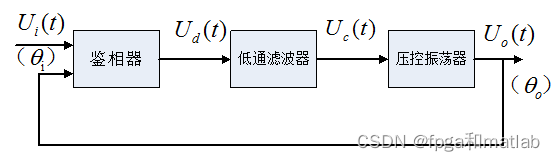
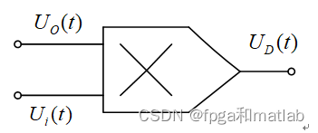
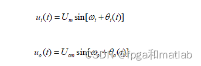
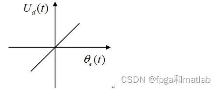
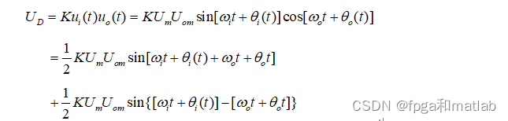
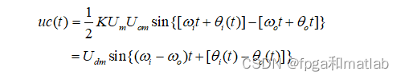
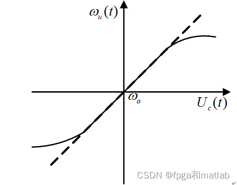
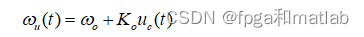
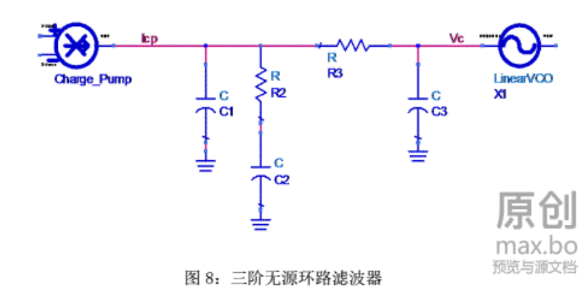

# PLL
## 基本原理
由鉴相器(Phase Detector:PD),低通滤波器(Low Pass Filter:LPF),压控振荡器(Voltage Controlled Oscillator:VCO),自动增益控制(AGC)等电路组成.这三个模块组成的锁相环为基本锁相环

当环路处于锁定状态时，如果输入参考信号的频率和相位发生变化，通过环路的控制作用，压控振荡器的频率和相位能不断追踪输入参考信号的频率的变化而变化，是环路重新进入锁定状态的动态过程乘坐环路的追踪过程。打法过环路不处于锁定和追踪状态的过程叫失踪。
## 基本结构
### 鉴相器
### 低通滤波器
### 压控振荡器
锁相环中的鉴相器（PD）通常由模拟乘法器组成，利用模拟乘法器组成的鉴相器电路如图示：

鉴相器的工作原理是：设外界输入的信号电压和压控振荡器输出的信号电压分别为：

鉴相器的传输特性为：

        鉴相器有两个主要功能：一个是频率牵引，另一个是相位锁定。实际中使用的锁相环系统还包括放大器、分频器、混频器等模块，但是这些附的模块不会影响锁相环的基本工作原理，可以忽略。

2.2低通滤波器
       鉴相器乘法器的输出电压可以表示为：

低通滤波器（LF）的将上式的高频分量滤掉，剩下的差频分量作为压控振荡器的输入控制电压：

2.3压控振荡器
压控振荡器（VCO）的压控特性如图所示：

该特性说明压控振荡器的振荡频率wu为中心，随输入信号电压Uc线性地变化，变化的关系如下：  

锁相环有四种工作状态，即锁定状态、失锁状态、捕获过程和跟踪过程。

    1.锁定状态：整个环路己经达到输入信号相位的稳定状态。它指输出信号相位等于输入信号相位或者是两者存在一个固定的相位差，但频率相等。在锁定状态时，压控振荡器的电压控制信号接近平缓。

    2.失锁状态：环路的反馈信号与锁相环输入信号的频率之差不能为零的稳状态。当环路的结构设计有问题，或者是输入信号超出了锁相环的应用范围的时候都会进入失锁状态。这个状态意味着坏路没有正常工作。

    3.捕获过程：指环路由失锁状态进入锁定状态的过程。这个状态表明环路已经开始进入正常工作，但是还没有达到锁定的稳态。此过程应该是一个频率和相位误差不断减小的过程。

     4.跟踪过程：是指在PLL环路处于锁定状态时，若此时输入信号频率或相位因其它原因发生变化，环路能通过自动调节，来维持锁定状态的过程。由于输入信号频率或者相位的变化引起的相位误差一般都不大，环路可视作线性系统。PLL的这四种状态中，前两个状态称为静态，后两个状态称为动态。优秀的设计可以使PLL在上电后立刻进入捕获状态，从而快速锁定。

### 环路滤波器
环路滤波器是线性的低通滤波器，用来滤除输出电压中的高频分量和噪声。环路滤波器的设计对于整个锁相环的运行至关重要，它不只是滤除高频分量，更重要的是它会影响环路的重要参数，如相位噪声、环路稳定性及锁定时间等，虽然环路滤波器的实际电路通常非常简单，但是它对锁相环的整个性能有重大影响。
