# 数字通信的调制方式
## ASK
利用0或1的基带矩形波控制一个连续的载波，即基带矩形波与载波直接相乘
幅移键控法，载波幅度是随着调制信号而变化。最简单的形式是，载波在二进制调制信号控制下通断，这种方式可称为通断键控。
- 调制方式:用模拟乘法器实现调制器
- 调制类型:2ASK,MASK
- 解调方法:相干法，非相干法
### 2ASK
2ASK信号可以认为是一个单极性矩形序列和一个载波相乘，即$s(t)=m(t)cos(w_ct+{\phi}_c)={\sum}_{k=-\infty}^{\infty}a_kg(t-kT_s)cos(w_ct+{\phi}_c)$
式中,$g(t)$为持续时间为$T_s$的脉冲，而$a_k$满足以下条件,$a_k=\begin{cases}
0,概率为p \\ 1,概率为1-p
\end{cases}$
根据卷积定理可知，ASK调制即基带频谱完成了一次频谱搬移
基带信号频谱通常无限宽，但能量主要集中在主瓣带宽内，为防止其他频段干扰，大多数情况需要对发射信号进行带宽限制，以保证大部分能量通过，同时滤除带外频率分量。通常在调制前对基带进行滤波，这样基带信号就是一个频带较窄的信号，调制到高频后受其他频带干扰的概率较小
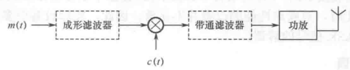
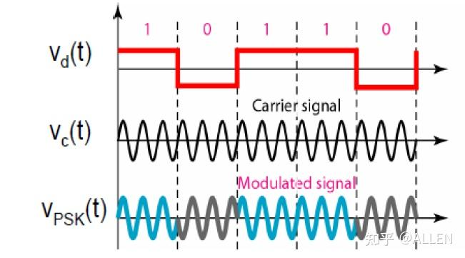
### MASK
待调制不再是单极性信号，而是将1分为$2^M$阶
MASK信号的带宽与2ASK信号的带宽相同，都是基带信号带宽的2倍
信息速率和频带利用率提高$\log_2M倍$
由于是多电平，所以要求调制器有较宽的线性范围
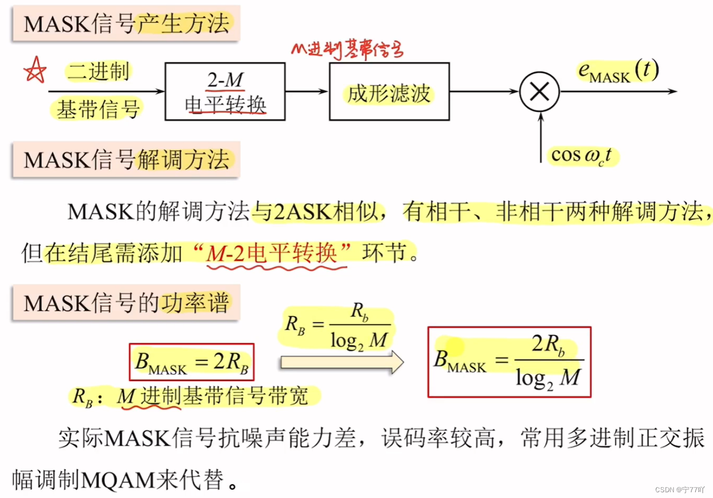
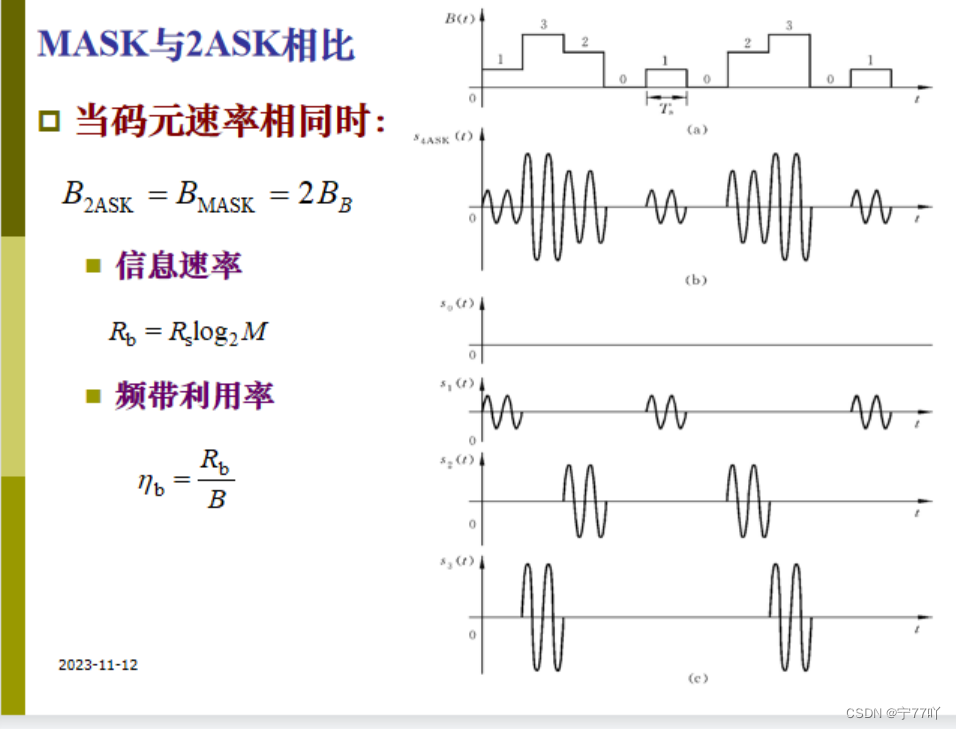
### 相干解调
将调制信号与载波信号相乘，将调制信号以$w_c$为中心频率再次搬移到原点，恢复了基带信号的位置，通过低通滤波将这一部分提取出来。还需要对LPF的输出进行抽样判决，根据判决结果输出0或1，得到原始信号，位定位脉冲是收发双方的同步需要。
采用相干解调接收端必须提供一个与ASK同频同相的载波。当解调载波频率不一样，就会出现其他的差频分量，滤波器可能无法滤除。当解调载波相位不一致，认可会付出基带信号，但幅度有所变化，在补偿增益时需要知道相干载波和解调载波的相位差。相干载波可以通过再带滤波和锁相环提取，实际中多采用包络检波实现解调
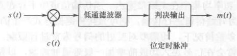
### 非相干解调
输入信号先通过整流电路，将直流信号转换成直流信号，而后通过低通滤波即可滤除基带的包络，最后门限进行判决，完成ASK的解调
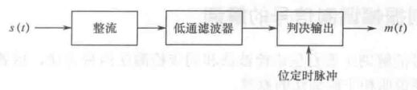
## FSK
利用基带数字信号离散取值的特点去键控载波频率以传递信息，通常用两个不同频率分别代表二级制数字0和1(2FSK)
### 2FSK
利用二进制信号去控制正弦载波的载频。
用两个振荡器生成两个振荡频率不同的信号。首先通过反相器和同相器组成的逻辑选择网络，来选择不同的路径，如果基带信号是1，则选择$f_1$的信号通过,如果基带信号是0，则选择$f_2$的信号通过，宣统开关的输出信号进入相加器，合并成一个信号，这个信号的频率会根据基带信号的变化而变化，从而生成2FSK信号
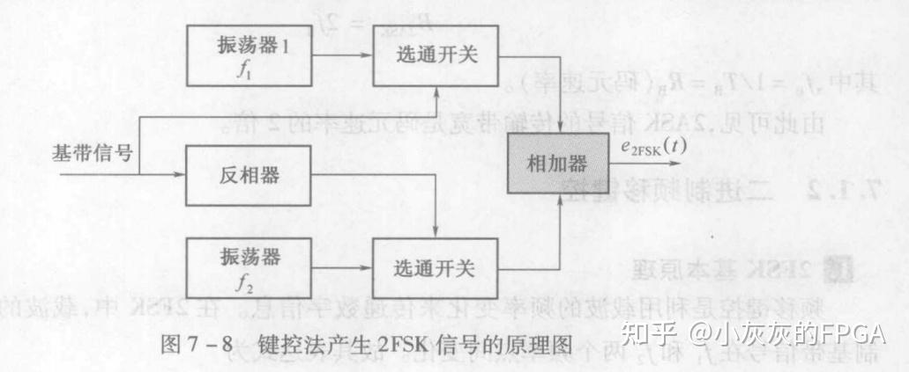
### MFSK调制
一种多进制数字调制技术，每个符号代表多个比特，每个符号对应一个特定频率，这些频率在预定义的频率计中选择。
输入的数字信号首先被转换成一系列的符号，每个符号对应一个特定频率的正弦波，这些正弦波随后被叠加在一起形成MFSK信号
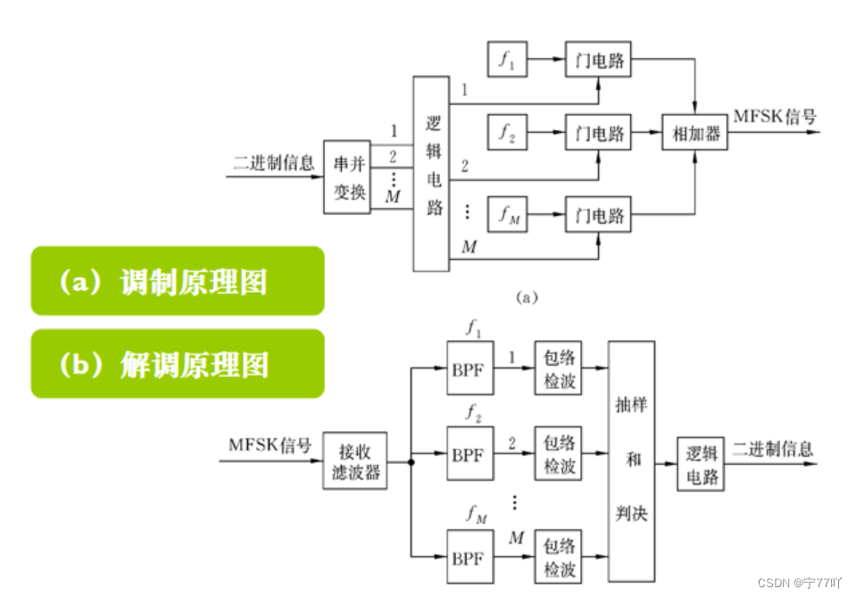
### 相干解调
输入信号被送入两个不同的路径，每条路径分别送入不同的带通滤波器，这两个滤波器的中心频率分别对应FSK调制中两个不同的载波频率，之后每个信号分别与和载波频率相同的余弦信号相乘，将信号下变频到基带，每个相乘后的信号都通过一个低通滤波器，滤除高频分量，只保留基带信号，最后通过判决模块，根据收到信号的强度或其它参数来决定最终的输出
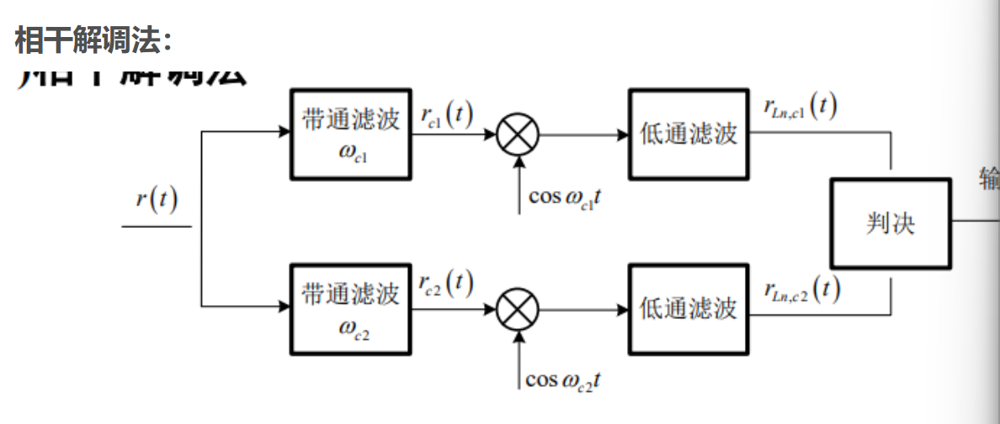
### 非相干解调
将输入信号送入两个带通滤波器，分别对应FSK调制的两个载波频率，(不用整流吗)，送入包络检波器提取出每个频率成分的幅度信息，最后这两个保罗信号被送到判决模块，通过比较两个幅度来决定那个频率存在，从而恢复原始的二进制数据。
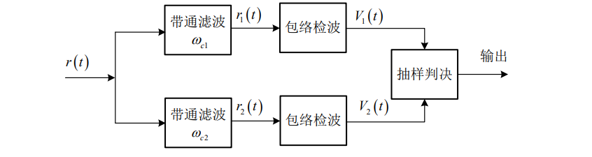
## PSK
用不同的相位表示不同的二进制数据，实现通过载波信号的相位随输入数据变化，幅度和频率保持不变
### BPSK
通过两种相位状态(0'和180')表示二进制数据
调制信号为$s(t)=A\cos{(w_ct+{\phi}_i)} \quad 其中{\phi}_i=0'(对应信号0)或180'(对应信号1)$
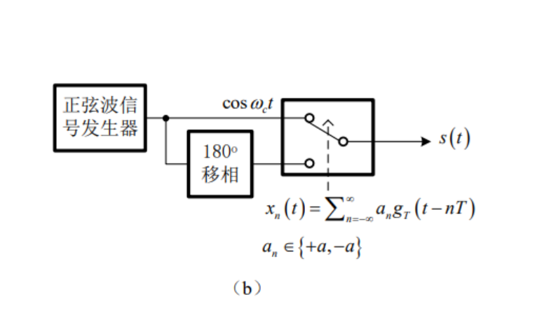
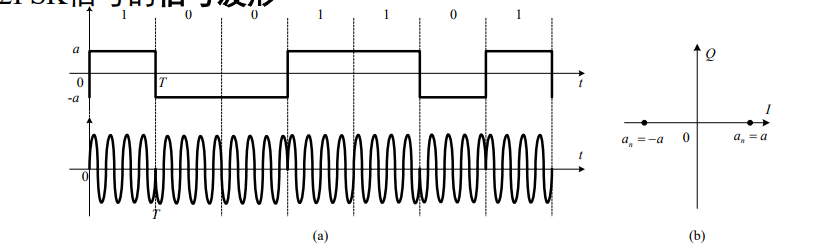
### QPSK
### 相干解调
### DPSK

## Reference
> [CSDN Link](https://blog.csdn.net/qq_63831368/article/details/134381850)