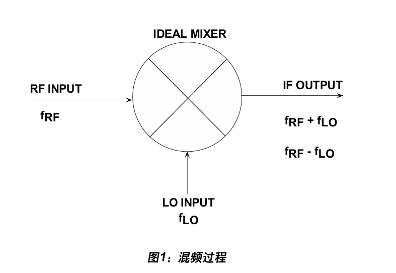
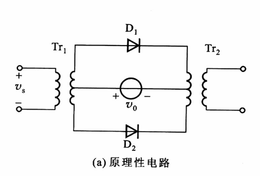
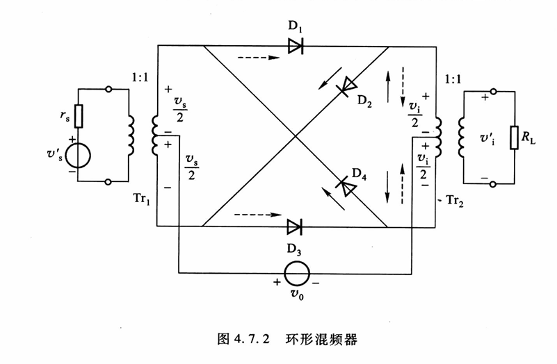

# 混频器
## 概述
RF混频器是一种可转换信号频率的有源或无源器件。它既可以调制信号，也可以解调信号。混频器具有三个信号连接端，分别是射频输入端(RF),本振输入端(LO)和中频输出端(IF).

混频器将频率为$f_{RF}$和RF输入信号与频率为$f_{LO}$的LO信号进行混频处理，并产生有和与差频率组成的IF输出信号。用户可以在混频器之后连接带通滤波器，从而选择和频率(上变频器)或者差频率(下变频器)
- 以和频率用作IF时，混频器称为上变频器。常用作发射通道中。使用差频率时，混频器则成为下变频器，常用于接收通道中。
- 在接收机中，当LO频率低于RF时，称作低端注入，当LO高于RF时，称为高端注入。
- 每个输出的幅度只有各输入的一半(功率为四分之一)，具有6dB的损耗
## 电路子类
### 模拟乘法器
通常具有两个信号输入端口(X,Y),所产生的输出W即为这两个端口上施加电压的线性乘积。为保持维度一致性，模拟线性乘法函数必须调用基准电压(U),Therefore,$W=\frac{XY}{U}$,在某些情况下，U实际上是第三路输入，可用于实现模拟除法。
- 单象限:X和Y必须是单极性信号
- 二象限:其中一路可以是双极性信号
- 四象限:X和Y都可以是双极性信号
常见型号:AD534,AD538.AD539,AD633,AD734,AD834,AD835其中最高精度AD734(精度+-0.02%)和最快速率AD834(超过500MHz)
### 调制器(符号变换器)
两路输入X和Y产生一路输出W,也就是其中一路输入乘以另一路达到符号，即$W=Y\times sign(X)$因此无需基准电压。良好的调制器在信号路径中具有极高的线性度，Y的正负值具有完全相等的增益，且X的正负值也具有完全相等的增益。
常见型号:AD831等高线性度混频器
### 混频器
针对频率转换而优化的调制器，其在信号路径中的位置通常靠近天线，其信号输入端除同时存在所需信号和高饶信号。因此，混频器必须拥有出色的线性度，即向RF端口施加测试信号时，达到可能的最高电平。其输出都应增加相同数量的dB,该特性由1dB增益压缩点和三界教条截点定义，转换过程由施加于LO端口的输入驱动。
噪声和匹配特性对混频器至关重要。最好使LO功率保持最低水平以及可能减少三个端口之间的串扰。给定RF和LO频率下，从RF到IF端口的增益称为转换增益;在典型的二极管电桥混频器中，转换增益小于-4dB.有源混频器可以提供更高的转换增益和更好的端口间隔离，但通常代价是噪声和线性度性能下降。

## 常见混频器电路
## 二级管单平衡混频器

### 二极管环形混频器(双平衡)

### 晶体管混频器
### 继承典论混频器