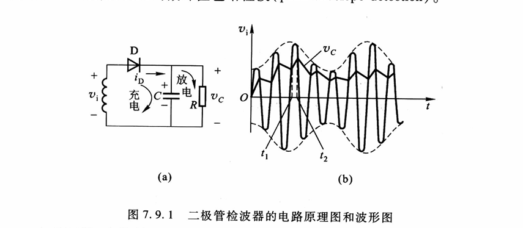
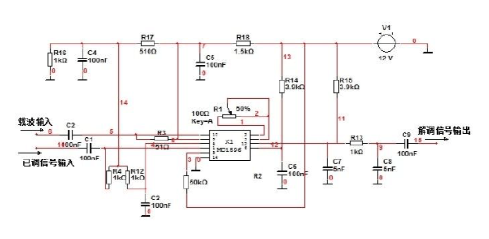
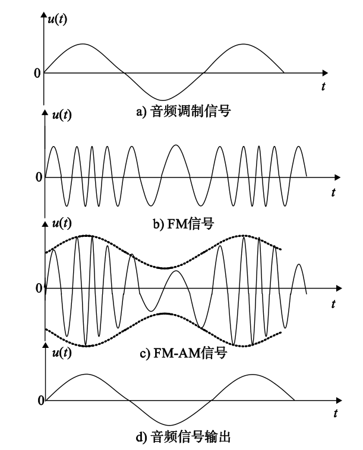
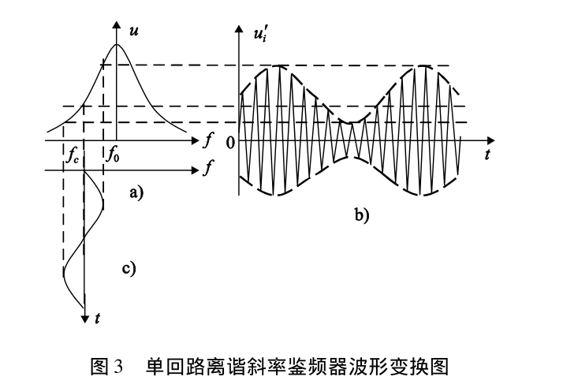
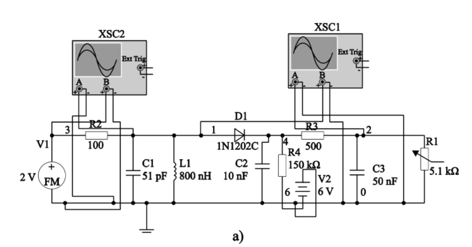
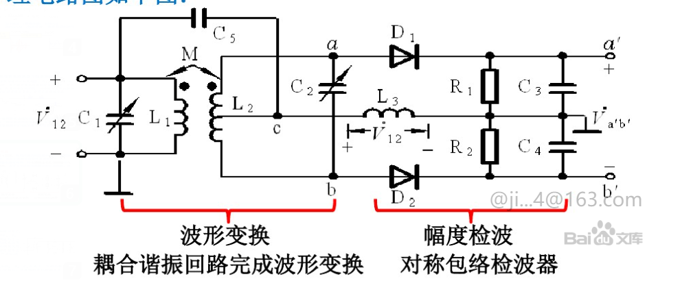

# 检波 Demodulation
## 定义
从调幅，调频，调相等已调制信号中提取原始调制包络检波
信号的过程。
## 目的
- 去除载波，保留调制信息的幅度，频率或相位变化
- 抑制噪声和干扰，提高信号质量
## AM检波
1. 包络检波
通过跟踪AM信号的包络来恢复原始信号
**目标**:提取包络$A_c[1+m(t)]$

  在高频信号正半周，二极管导通，并对电容器进行充电。由于二极管导通内阻小，充电电流小，使电容器上的电压很快上升，这时二极管导通与否，有点融其上的电压与输入信号电压共同决定。当高频电压由最大值下降到小于电容器上的电压时，二极管截止，电容器通过负载电阻放电，由于放电时间常数远大于高频电压的周期，故放电很慢。当电容器上的电压下降不多时，高频第二个正半周的电压有超过二极管上的负压，使二极管又导通，又对电容器充电，这样不断循环反复。只要选择RC和二极管D,以使充电时间常数$R_dC$足够小，充电很快;而放电时间常熟RC足够大，放电很慢，就可使C两端电压的幅度与输入的电平的幅度相当相近，即传输系数接近1，输出电压与高频调幅波包络基本一致，所以又叫峰值包络检波。
  **失真**
  - 对角线失真
  - 割底失真
  - 非线性失真
  - 频率是真
2. 同步检波
一种需要本地生成与载波同频同相参考信号的解调技术，主要解调抑制载波(DSB,SSB)的调制信号，也可改善标准AN洗不好的抗噪声性能，其核心使通过信号相乘和滤波提取原始基带信息。
**原理**
假设接收的已调信号为$s(t)=m(t)\cos{(w_ct+\phi)}$ 其中$m(t)$为调制信号,$\phi$为载波相位偏移
本地生成的参考载波为$c(t)=\cos{(w_ct+{\phi}^r)}$
将两者相乘后$s(t)\cdot c(t)=m(t)\cdot \cos{(w_ct+\phi)}\cdot \cos{(w_ct+{\phi}^r)}$
利用三角恒等式得$=\frac{1}{2}m(t)[\cos{(2w_ct+\phi+{\phi}^r)}+\cos{(\phi-{\phi}^r)}]$
通过低通滤波器滤除高频分量输出为$y(t)=\frac{1}{2}m(t)\cdot \cos{(\phi-{\phi}^r)}$
当$\phi={\phi}^r$时，输出为$y(t)=\frac{1}{2}m(t)$

## PM检波器

## FM检波
1. 斜率鉴频器
由调频-调幅变换器和包络检波器两部分组成，调频-调幅变换器常常是失谐得LC谐振电路将FM信号得频率变化变换转化成幅度变化，然后通过保罗检波器提取调制信号。其原理是当调频波电流流过回路时，回路对于不同瞬时频率的失谐所呈现得阻抗不同，回路电压振幅随FM波得瞬时频率f而变化，当瞬时频率大于中心频率时，回路失谐小，回路输出电压大，当瞬时频率小于中心频率时，回路失谐大，回路输出电压小，这时得并联回路电压就是一个调频-调幅波，但谐振回路就是一个能够把调频波变换成调频-调幅波得变换器。单回路失谐鉴频器的有点事电路结构简单，但由于回路谐振曲线的弯曲，非线性失真比较大

2. 相位鉴频器
    一种利用相位-频率关系将调频信号转换为调频-调相信号，然后通过鉴相器提取原始调制信号。
    先将调频波经过一个线性移相网络变换成调频调相波，然后再与源调频波一起加到一个相位检波器进行检品。
    
    输入电路的初级回路C和L和刺激贿赂C，L均调谐与调频波的中心频率。他们完成波形变换，将等幅调频波变换成幅度随瞬时匹女变化的调频波(调幅调频波)两组D,R,C组成上下两个振幅检波器，且特性完全相同，将振幅的变化检测出来
    The detail to be continued
3. 比例鉴频器
4. 锁相环检波器

Reference
- [百度文库同步检波电路](https://wenku.baidu.com/view/e72f629051e79b8968022666.html?_wkts_=1738673057089&needWelcomeRecommand=1)
- [斜率鉴频器实验报告](https://www.doc88.com/p-1107437474653.html?r=1)
- DeepSeek
- 高频电子线路