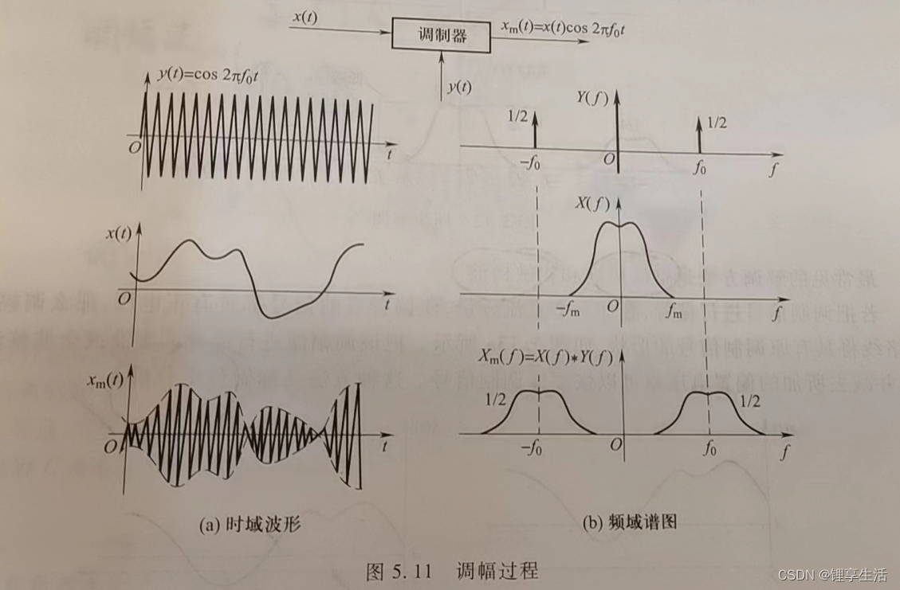
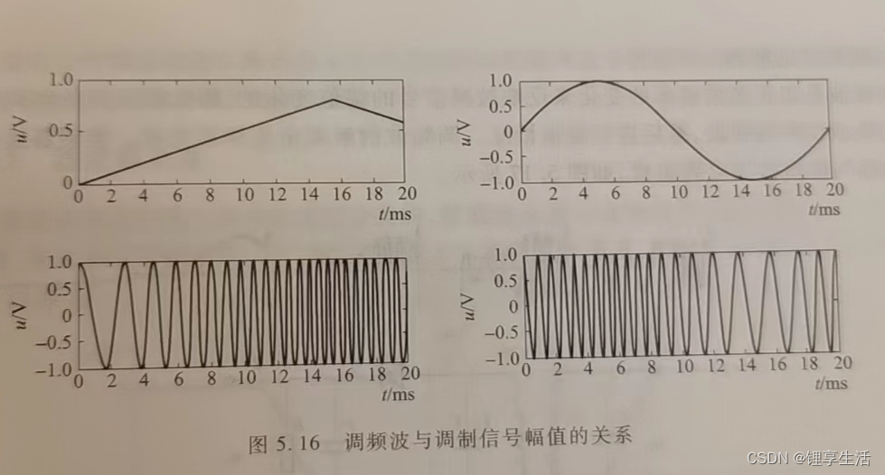
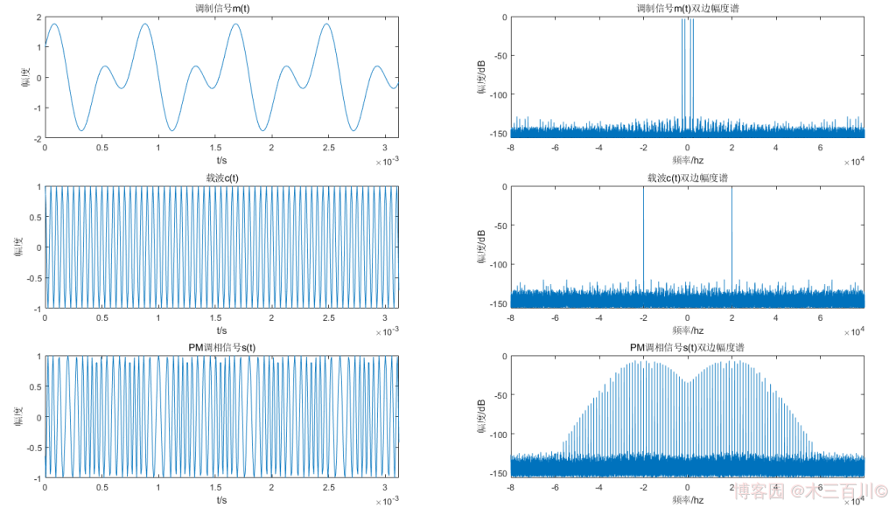
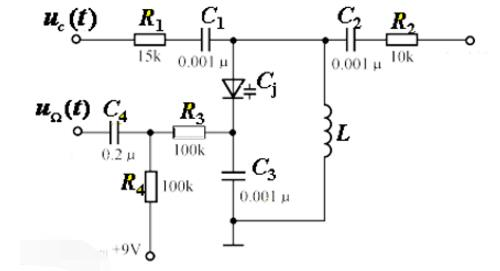
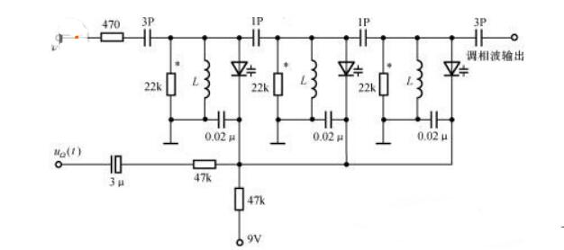

# 信号的调制
##  信号调制 Modulation
**调制** 是指将要传输的信息信号按照一定的规则改变载波信号的某个或某些参数的过程，这使得信号能够能够适应特定传输介质的特性，有效地在远距离上进行传输，同时也能实现频率的分配，十多个信号能够同时在不同频段减少干扰
**信号的三要素**：**振幅**、**频率**、**相位** 
调制可分为调幅，调频，调相，其波形分别被称为调幅波，调频波，调相波
其中调频和调相是角度调制，本质是非线性调制，非线性的频谱搬移，调制后带宽比较大，牺牲了带宽换取较好的抗噪性能
## 调幅 AM:Amplitude Modulation
改变载波的幅度，反应要传播的信号
基本思想是使载波的幅度正比于信息信号的瞬时值，实现方式是使载波信号与信息信号相乘，要求载波信号的频率必须远大于·调制信号的频率。
调幅的目的是为了缓变信号的放大与传送，为了减少放大电路可能引起的失真，信息信号的频宽2$f_m$相对于中心频率$f_0$越小越好(要求载波信号的频率远大于调制信号频率的原因，调制后所得两个信号的频谱不会相交，即不会发生混叠现象)

**电路实现**
- 模拟乘法器电路:通过将带有直流偏置的调制信号与载波相乘，生成AM信号。$s(t)=[A+m(t)]\cdot \cos{w_c t}$
  用集成模拟乘法器芯片(MC1496,AD633 etc)直接输入调制信号和载波，输出即AM信号，或吉尔伯特单元基于晶体管的跨导特性实现乘法功能:线性度高，失真小，适用于现代低功率通信系统
- 晶体管调幅:将调制信号加载到晶体管放大器的集电极电源，通过改变电源电压控制输出信号的幅度:适合高功率发射机，效率较高
**特点**
- 技术简单，制作成本较低
- 在信号强度下降(如距离增加)时，容易收到噪声和干扰的影响
- 频谱频率较低，即单位频段内所能传送的信息量相对较少
- 主要用于中波和短波广播和业余无线电
## 调频 FM:Frequency Modulation
改变载波的频率，反应要传播的信号
载波的频率根据信息信号的顺势振幅变化，而载波的幅度保持恒定，更容易实现数字化，在传输过程中不易受到干扰。

**原理**
利用信号电压的幅值控制一个振荡器，振荡器输出的是等幅波，但其振荡频率偏移量和信号电压成正比，信号电压为正值时调拼搏频率升高，幅值时降低，信号电压为零时，调幅波的频率等于中心频率。
${f(t)=f_c+k\cdot m(t)}$
${其中m(t)是调制信号}$
**电路实现**
- 直接调制:直接将信号反馈到一个压控振荡器的输入实现:晶体管压控振荡器:通过晶体管放大器的偏置电压调整振荡频率(Copitts或Hartley振荡器)：结构简单，调频范围宽，适用于广播,无线麦克风:频率稳定性较低，需配合自动频率控制电路
- PPL-Based FM:通过锁相环的反馈机制，将调制信号注入压控振荡器的控制端，生成FM信号，用集成锁相环芯片(NE564,CD4046)结合外部VCo和滤波器：频率稳定性高，抗干扰能力强，适用于通信系统:调频范围受PLL带宽限制
- 数字调频:利用DDS或FPGA生成FM信号，DDS芯片根据数字调制信号是使计算输出频率，FPGA通过算法生成调频波行(查表法或CORDIC算法):精度高，灵活性强，支持复杂调制:成本高，需数字信号处理支持
- 集成FM调制器芯片:NE566,XR2206
- 间接调制:信息信号首先积分生成调相信号，用于调制晶体振荡器，得到的信号通过备品信号产生FM信号，这种调制中，先生成窄带FM信号，随后在产生宽带FM信号
**特点**
- 由于信息被编码在频率上，因此对信号强度的变化不敏感，使得FM有更好的抗噪声性能
- 频谱效率比AM高，可以提供更好的声音质量，因为她能够有效音质噪声和干扰
- 由于其抗干扰特性，FM广播可以提供接近CD质量的音频信号
## 调相 PM:Phase Modulation
改变载波的相位，反应要传播的信号
用调制信号去控制载波的瞬时相位，使其按照调制信号的规律变化，载波的幅度统称为角度调制。

**实现电路**
- 可变移相法:利用变容二极管和电感组成的调谐回路，变容二极管的电容随反向电压变化而变化，从而改变贿赂的谐振频率
  变容二极管是利用半导体PN结反向电压变化而制成的而半导体器件.其结电容$C_j$与反向电压$v_R$的关系$C_j=\frac{C_{j0}}{{1+\frac{v_R}{V_D}}^{\gamma}}$
  加到变容管的反向电压$v_R(t)=V_0+V_{\Omega}\cos{\Omega t}$包括直流偏置和调制信号电压
  电容的变化引起调谐电路的谐振频率的变化，谐振频率的变化引起信号相位的变化，从而实现调相
  To be continuned
  下述电路通过变容二极管和电感组成的谐振回路，实现了对输入载波信号的相位调制
  $\phi=-\arctan{2Q\frac{\Delta \omega}{\omega}}$
  当$\phi<\frac{\pi}{6}$时，可近似arctan函数具有线性,   即$\phi=-2Q\frac{\Delta \omega}{\omega}$可推出$\phi=\frac{Qk_cV_{\Omega}}{C_0}f(t)$

    但这种方法只能产生最大$\frac{\pi}{6}$的相移，若想获得更大相移则应级联多级电路

**原理**
PM信号的时域表达式:
${s_{PM}(t)=A\cos{w_ct+K_pm(t)}}$
${其中A为载波恒定振幅，K_p为调相灵敏度，m(t)为调制信号，\cos(w_ct)为载波, PM信号相对于载波相位w_ct的瞬时相位偏移为\phi(t)=K_pm(t)}$
PM信号的调相指数$\beta$被定义为最大的相位偏移$\beta=H_p{\lvert m(t) \rvert}_{max} $

# Reference 
- [信号的调制:AM FM](https://blog.csdn.net/m0_63227758/article/details/138444514)
- [PM](https://blog.csdn.net/m0_37803477/article/details/131796491)
- [相位调制.zh.wiki](https://zh.wikipedia.org/wiki/%E7%9B%B8%E4%BD%8D%E8%B0%83%E5%88%B6)
- [频率调制.zh.wiki](https://zh.wikipedia.org/wiki/%E9%A2%91%E7%8E%87%E8%B0%83%E5%88%B6)
- [相位调制变容二极管调谐.电子发烧友](https://www.elecfans.com/dianzichangshi/20180416662720.html)
- Kimi 向Kimi发送电路原理图再加上适量的prompt,可获得较为详细的解释，以后可研究这个方向Finr-tuning VLM by EE knowledge
- 高频电子线路 第五版 张啸文