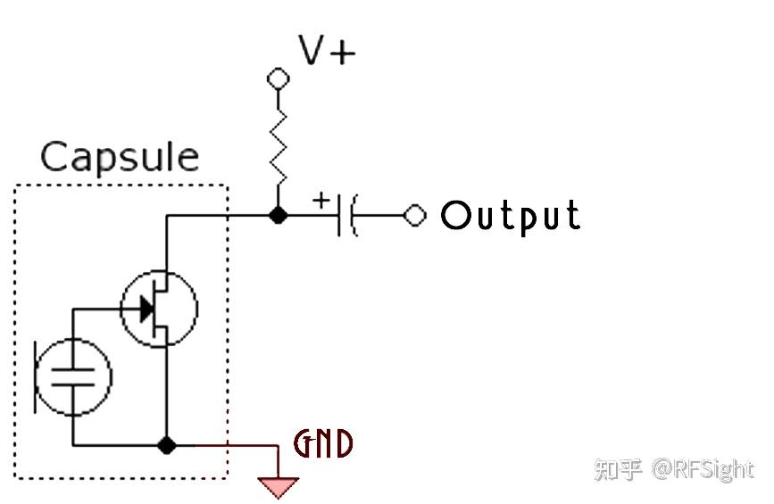
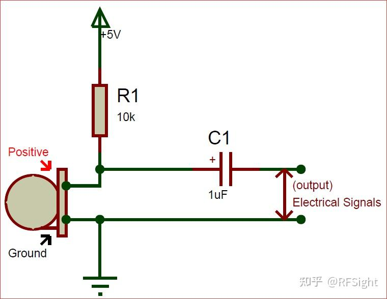

# 驻极体麦克风
## 概括
最常用的电容麦克风，用于将微弱的声音转换为电信号的设备
## 特点
- 体积小
- 结构简单
- 电声性能好
- 性价比高

## 基本结构
驻极体薄膜，带孔背电极，和内置场效应管。驻极体薄膜和带孔背电极组合为一个平行板电容器，相当于可变电容
## 工作原理
声波振动会引起驻极体薄膜振动，进而产生位移，改变了电容两个极板之间的距离，引起了电容的容量发生变化，而驻极体上的电荷数量始终保持恒定，根据公式$Q=C\times U$,电容器两端的电压会随电容容量实时变化，从而实现了声电变换。
由于电容器很小，输出的电信号是非常微弱的，他的输出阻抗也极高，因此不能直接与音频放大电路连接，为了增强带负载能力，必须连接一个阻抗变换器，通常内置一个场效应管电路进行阻抗变换。
## 应用电路

一般驻极体麦克风供电电压为5V.
电阻器用于限制流过麦克风的电流(0.5mA),电容器用于过滤可能与模拟电信号耦合的直流噪声，此外，电容的正极硬链接麦克风输出引脚,该电容器额定频率为20Hz止16kHz,该范围内的任何声波都会被麦克风拾取。
## 极性判断
用二极管的正反向电阻来判别驻极体话筒的漏极D和源极S